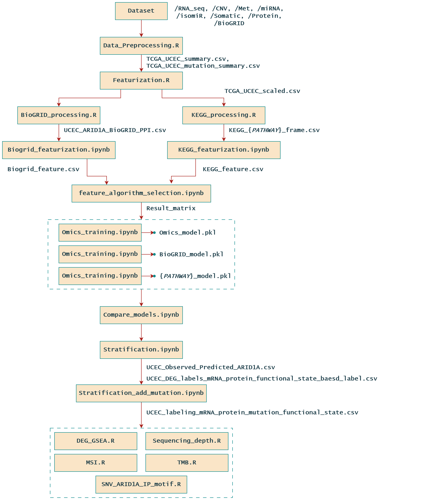

# **A Novel Method for Endometrial Cancer Patient Stratification Considering ARID1A Protein Expression and Activity with Effective Use of Multi-omics Data**

## 📚 Overview

This repository contains the code and documentation for the analysis presented in our manuscript:

> Junsoo Song, Ayako Ui, Kenji Mizuguchi, Reiko Watanabe.
> 
> 
> *A Novel Method for Endometrial Cancer Patient Stratification Considering ARID1A Protein Expression and Activity with Effective Use of Multi-omics Data.*
> 
> **Computational and Structural Biotechnology Journal**, 2025.
> 
> ISSN: 2001-0370
> 
> [https://doi.org/10.1016/j.csbj.2025.06.015](https://doi.org/10.1016/j.csbj.2025.06.015)
> 

## 🚩 Workflow

## ⚠️ Important Notes

1. **Data Source – TCGA UCEC Cohort**
    
    This analysis pipeline uses data from the **TCGA Uterine Corpus Endometrial Carcinoma (UCEC)** cohort.
    
    You can obtain the data via the [GDC Data Portal](https://portal.gdc.cancer.gov/) or by using the R package **`TCGAbiolinks`**.
    
    The current code supports both methods and organizes the files into subdirectories under the `dataset/` folder.
    
2. **Indexing Issues**
    
    Some parts of the analysis access dataframes using integer-based indexing (e.g., `iloc`).
    
    Depending on the dataset version or file loading behavior, row ordering may differ.
    
    Manual adjustments to indices may be necessary to align with the expected structure.
    
3. **External Data Requirements**
    
    This pipeline uses several **external datasets** not bundled with the repository. These include:
    
    - miRDB target prediction data
    - miRNA arm feature annotations
    - Illumina CpG probe ID reference
    - `gencode.v43.annotation.gtf.gz` for gene annotation
    
    You may need to download these resources separately depending on your use case.
    
    Please refer to the main text of the published paper for further details and download instructions.
